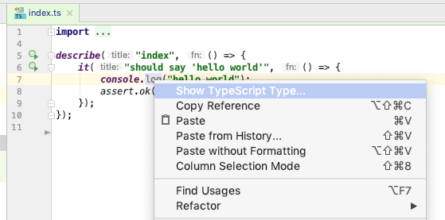
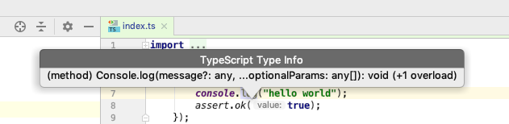

# TypeScript Show Type Plugin for WebStorm / IntelliJ Ultimate
Show the Type at Cursor Position in TypeScript files in IntelliJ/WebStorm.

## Download and install from disk

Currently it has two prototype implementations : 

- [WebStorm / IntelliJ Ultimate 2018.1](https://github.com/fbanados/webstorm-showtype/raw/master/showtype-1.0-SNAPSHOT-2018.1.zip)

- [WebStorm / IntelliJ Ultimate 2018.3](https://github.com/fbanados/webstorm-showtype/raw/master/showtype-1.0-SNAPSHOT.zip)

## Usage

The Plugin provides an extra option on the editor popup menu if you are in a TypeScript file:

When clicked, it will show the type of the element at the cursor position:

Note that the popup may not provide useful information in every file position.  You may want to try around your files!

